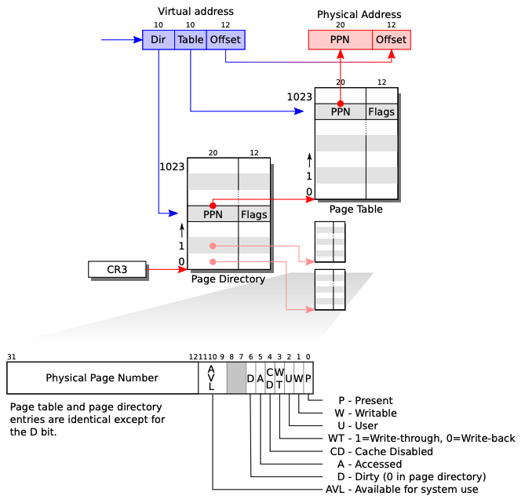

# P4 -- Continued

## Virtual Memory
xv6 uses two-level page table:  


HINT: The clock queue is a queue-like structure storing all the virtual pages that are currently decrypted. The other essential part of a clock algorithm is a reference bit that gets set to 1 every time a page is accessed. Luckily for us, x86 hardware sets the sixth bit (or fifth if you start from 0. 0x020, to be precise) of the corresponding page table entry to 1 every time a page is accessed.

Page table in xv6:
```c
// A virtual address 'la' has a three-part structure as follows:
//
// +--------10------+-------10-------+---------12----------+
// | Page Directory |   Page Table   | Offset within Page  |
// |      Index     |      Index     |                     |
// +----------------+----------------+---------------------+
//  \--- PDX(va) --/ \--- PTX(va) --/

// page directory index
#define PDX(va)         (((uint)(va) >> PDXSHIFT) & 0x3FF)


// page table index
#define MAX_PTX         0x3FF
#define PTX(va)         (((uint)(va) >> PTXSHIFT) & MAX_PTX)

#define PPN(pa)         ((uint)(pa) >> PTXSHIFT)
#define OFFSET(va)      ((uint)(va) & 0xFFF)


// construct virtual address from indexes and offset
#define PGADDR(d, t, o) ((uint)((d) << PDXSHIFT | (t) << PTXSHIFT | (o)))

// Page directory and page table constants.
#define NPDENTRIES      1024    // # directory entries per page directory
#define NPTENTRIES      1024    // # PTEs per page table
#define PGSIZE          4096    // bytes mapped by a page

#define PTXSHIFT        12      // offset of PTX in a linear address
#define PDXSHIFT        22      // offset of PDX in a linear address

#define PGROUNDUP(sz)  (((sz)+PGSIZE-1) & ~(PGSIZE-1))
#define PGROUNDDOWN(a) (((a)) & ~(PGSIZE-1))

// Page table/directory entry flags.
#define PTE_P           0x001   // Present
#define PTE_W           0x002   // Writeable
#define PTE_U           0x004   // User
#define PTE_PS          0x080   // Page Size
//changed: Added PTE_E. You have 12 bits for flags according
//to page 30 of the textbook
#define PTE_E           0x400
```
in vm.c: walkpgdir returns the page table entry when given a virtual address and the page table directory:
```c
// Return the address of the PTE in page table pgdir
// that corresponds to virtual address va.  If alloc!=0,
// create any required page table pages.
static pte_t *
walkpgdir(pde_t *pgdir, const void *va, int alloc)
{
  pde_t *pde;
  pte_t *pgtab;

  pde = &pgdir[PDX(va)];
  if(*pde & PTE_P){
    //if (!alloc)
      //cprintf("page directory is good\n");
    pgtab = (pte_t*)P2V(PTE_ADDR(*pde));
  } else {
    if(!alloc || (pgtab = (pte_t*)kalloc()) == 0)
      return 0;
    // Make sure all those PTE_P bits are zero.
    memset(pgtab, 0, PGSIZE);
    // The permissions here are overly generous, but they can
    // be further restricted by the permissions in the page table
    // entries, if necessary.
    *pde = V2P(pgtab) | PTE_P | PTE_W | PTE_U;
  }
  return &pgtab[PTX(va)];
}
```
## Page Fault

We are using page fault to decrypt the data. When the user accesses an encrypted page, we (the kernel) want to decrypt the data before it actually see the data. To do this, we use page fault as a hack. We clear the "present" bit of this page so every time the user tries to access this page, the CPU will trigger a page fault and ask the kernel to handle. The kernel can then involve to decrypt the data.

The page fault is also a trap. Its trap number is defined in `traps.h`

```C
#define T_PGFLT         14      // page fault
```

In `trap.c`, let's take another look at the trap handler:

```C
void
trap(struct trapframe *tf)
{
// ...
  switch(tf->trapno){
  case T_IRQ0 + IRQ_TIMER:
    // ...
  case T_IRQ0 + IRQ_IDE:
    // ...
  case T_IRQ0 + IRQ_IDE+1:
    // ...
  case T_IRQ0 + IRQ_KBD:
    // ...
  case T_IRQ0 + IRQ_COM1:
    // ...
  case T_IRQ0 + 7:
  case T_IRQ0 + IRQ_SPURIOUS:
    // ...
  default:
    if(myproc() == 0 || (tf->cs&3) == 0){
      // In kernel, it must be our mistake.
      cprintf("unexpected trap %d from cpu %d eip %x (cr2=0x%x)\n",
              tf->trapno, cpuid(), tf->eip, rcr2());
      panic("trap");
    }
    // In user space, assume process misbehaved.
    cprintf("pid %d %s: trap %d err %d on cpu %d "
            "eip 0x%x addr 0x%x--kill proc\n",
            myproc()->pid, myproc()->name, tf->trapno,
            tf->err, cpuid(), tf->eip, rcr2());
    myproc()->killed = 1;
  }
}
```

You may notice there is no `case` for  `T_PGFLT`, which means it will fall into `default`, whose behavior is to kill the process. Now you need to add a `case` for `T_PGFLT` to decide whether it is indeed an invalid memory access or just access an encrypted memory. If it is an encrypted memory, you need to decrypt it instead.

## A few random bits based on Piazza questions:

- We can see, above, that there are several flag bits for PTEs and PDEs.
When we want to mark a page table entry as active/accessed or not, we should take advantage of the existing "accessed" flag.
We can use this as the hot/cold bit for the clock algorithm.
This is why we suggest defining a `PTE_A` mask.

- A brief review of bitmasks:
C provides a bunch of bitwise operators, for example:
```c
uint x, y;
// values get set
uint and_result = x & y; // we get '1' wherever bits match
uint or_result = x | y; // we get '1' wherever either bit was a '1'
```
Ok, so how do these help manage flags?  
We can use "masks" to isolate one or more flags.
Suppose we want to get flag "U" from a page table entry:
```c
// "places" for each of 12 bits: 8 4 2 1   8 4 2 1   8 4 2 1
// PTE_U as a series of 12 bits: 0 0 0 0   0 0 0 0   0 1 0 0
#define PTE_U 0x004

uint *pte; // we've got an entry.
uint pte_u = *pte & PTE_U; // pte_u is set to '1' if 3rd bit of *pte is '1', or '0' if 3rd bit is '0'

if (*pte & PTE_U) {
  // code runs if 3rd bit of *pte is '1', otherwise skipped.
}
```

On the other hand, to "set" a bit, we can use OR operation:

```c
*pte = *pte | PTE_U; // PTE_U only has a '1' at 3rd bit. So 3rd bit of *pte is now '1', all other bits remain the same.
```

- xv6 works with virtual addresses in some places, physical addresses in others.
Be careful to check what type of address you're using at any given time, and what type of address any functions you call require.

<!-- https://piazza.com/class/kolxzgun59y5rs?cid=238
https://piazza.com/class/kolxzgun59y5rs?cid=241 -->
<!-- ## How to  -->
 
<!-- ## Where to encrypt in exec() -->
