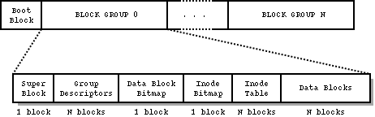
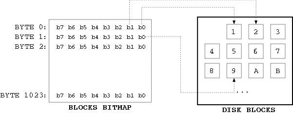
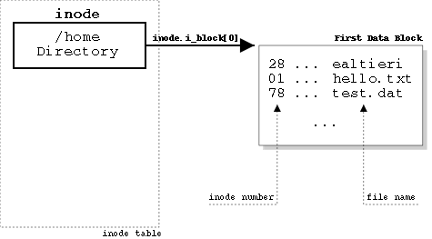
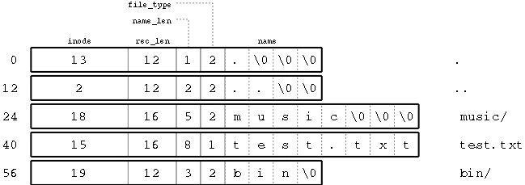
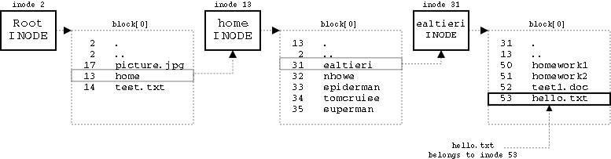

# Week - 13 : Ext 2 FS

## Basics 
 In the following example, we have taken a 1.44MB floppy disk. We will use the same device in our examples later. 


The first 1024 bytes of the disk, the "boot block", are reserved for the partition boot sectors and are unused by the Ext2 filesystem. The rest of the partition is split into block groups, each of which has the layout shown in the figure above. On a 1.44 MB floppy disk, there is only one block group. 

### Superblocks
The superblock contains all the information about the configuration of the filesystem. The information in the superblock contains fields such as the total number of inodes and blocks in the filesystem and how many are free, how many inodes and blocks are in each block group, when the filesystem was mounted (and if it was cleanly unmounted), when it was modified, what version of the filesystem it is and which OS created it.

The primary copy of the superblock is stored at an offset of 1024 bytes from the start of the device, and it is essential to mounting the filesystem. Since it is so important, backup copies of the superblock are stored in block groups throughout the filesystem. 

The superblock is defined in `struct ext2_super_block`:
```C
struct ext2_super_block {
	__u32	s_inodes_count;		/* Inodes count */
	__u32	s_blocks_count;		/* Blocks count */
	...
	__u32	s_free_blocks_count;	/* Free blocks count */
	__u32	s_free_inodes_count;	/* Free inodes count */
	__u32	s_first_data_block;	/* First Data Block */
	__u32	s_log_block_size;	/* Block size */
	...
	__u32	s_blocks_per_group;	/* # Blocks per group */
	...
	__u16	s_magic;		/* Magic signature */
	...
```

`s_inodes_count` and `s_blocks_count` store the number of inodes and blocks on disk.

**NOTE** If the total number of blocks on a floppy disk is 1440 and the number of inodes is 184. What is the total size of fs?
1440 blocks * 1024 bytes = 1440 KB

 The size of a block is given by `s_log_block_size`. This value expresses the size of a block as a power of 2, using 1024 bytes as the unit. Thus, 0 denotes 1024-byte blocks, 1 denotes 2048-byte blocks, and so on. To calculate the size in bytes of a block:

```C
unsigned int block_size = 1024 << super.s_log_block_size;   /* block size in bytes */
```
The super block also tells us the number of blocks per group with `s_blocks_per_group`. 

 The superblock is located at offset 1024 of a floppy. The code to read the superblock from a floppy is shown below. This code also checks the magic number of the super block (`EXT2_SUPER_MAGIC`) to see if we are reading from an Ext2 filesystem. For simplicity, error checking has been omitted.

```C
#include <linux/ext2_fs.h>

int main()
{
    int fd;
    struct ext2_super_block super;

    fd = open("/dev/fd0", O_RDONLY);    /* open floppy device */

    lseek(fd, 1024, SEEK_SET);                    /* position head above super-block */
    read(fd, &super, sizeof(super));              /* read super-block */

    if (super.s_magic != EXT2_SUPER_MAGIC)
            exit(1); /* bad file system */	

        block_size = 1024 << super.s_log_block_size;  /* calculate block size in bytes */

```
[`ext2super.c`](ext2super.c) reads the superblock from a floppy disk and prints it to screen.

### Group Descriptors
In the blocks immediately following the super-block reside the list of block-group descriptors. This list contains a descriptor for each block group on the disk. In the case of a floppy, there is only one block group and therefore one group descriptor. For a bigger disk, we would have to calculate the size of this list by using `s_blocks_count` and `s_blocks_per_group` in the superblock:

```C
/* calculate number of block groups on the disk */
unsigned int group_count = 1 + (super.s_blocks_count-1) / super.s_blocks_per_group;

/* calculate size of the group descriptor list in bytes */
unsigned int descr_list_size = group_count * sizeof(struct ext2_group_descr);
```

A group descriptor is defined by the `ext2_group_descr` structure. This structure is reported below:

```C
struct ext2_group_desc
{
	__u32	bg_block_bitmap;	/* Blocks bitmap block */
	__u32	bg_inode_bitmap;	/* Inodes bitmap block */
	__u32	bg_inode_table;		/* Inodes table block */
	__u16	bg_free_blocks_count;	/* Free blocks count */
	__u16	bg_free_inodes_count;	/* Free inodes count */
	__u16	bg_used_dirs_count;	/* Directories count */
	__u16	bg_pad;
	__u32	bg_reserved[3];
};
```
A 1.44 MB floppy has one group descriptor only, which can be read using the following code:

```C 
struct ext2_group_descr group_descr;
lseek(fd, 1024 + block_size, SEEK_SET);  /* position head above the group descriptor block */
read(fd, &group_descr, sizeof(group_descr));
```
[`ext2group.c`](ext2group.c)  reads the first (and only) group descriptor of a floppy disk and prints it to screen.

he group descriptor tells us the location of the block/inode bitmaps and of the inode table (described later) through the `bg_block_bitmap`, `bg_inode_bitmap` and `bg_inode_table` fields. These values indicate the blocks where the bitmaps and the table are located. It is handy to have a function to convert a block number to an offset on disk, which can be easily done by knowing that all blocks on disk have the same size of `block_size` bytes (calculated earlier from the super-block):

```C
#define BASE_OFFSET 1024  /* location of the super-block in the first group */

#define BLOCK_OFFSET(block) (BASE_OFFSET + (block-1)*block_size)
```

Blocks are numbered starting from 1. Block 1 is the superblock of the first group, block 2 contains the group descriptors, and so on. Block 0 is the NULL block and does not correspond to any disk offset.

### The blocks and inodes bitmaps

A bitmap is a sequence of bits. Each bit represents a specific block (blocks bitmap) or inode (inode bitmap) in the block group. A bit value of 0 indicates that the block/inode is free, while a value of 1 indicates that the block/inode is being used. A bitmap always refers to the block-group it belongs to, and its size must fit in one block. 



Limiting the size of a bitmap to one block also limits the size of a block-group, because a bitmap always refers to the blocks/inodes in the group it belongs to. Consider the blocks bitmap: given a block size of 1024 bytes, and knowing that each byte is made of 8 bits, we can calculate the maximum number of blocks that the blocks bitmap can represent: 8 * 1024 = 8192 blocks. Therefore, 8192 blocks is the size of a block-group using a 1024-byte block size.

 The following code fragment reads the block bitmap from disk:

```C
struct ext2_super_block super;  /* the super block */
struct ext2_group_desc group;   /* the group descritopr */
unsigned char *bitmap;

/* ... [read superblock and group descriptor] ... */

bitmap = malloc(block_size);    /* allocate memory for the bitmap */
lseek(fd, BLOCK_OFFSET(group->bg_block_bitmap), SEEK_SET);
read(fd, bitmap, block_size);   /* read bitmap from disk */
free(bitmap);
```

### The inode table

 The inode table consists of a series of consecutive blocks, each of which contains a predefined number of inodes. The block number of the first block of the inode table is stored in the `bg_inode_table` field of the group descriptor. To figure out how many blocks are occupied by the inode table, divide the total number of inodes in a group (stored in the `s_inodes_per_group` field of the superblock) by the number of inodes per block:

```C
/* number of inodes per block */
unsigned int inodes_per_block = block_size / sizeof(struct ext2_inode);

/* size in blocks of the inode table */
unsigned int itable_blocks = super.s_inodes_per_group / inodes_per_block;
```
In the case of our floppy disk, we can see from the output of mkfs.ext2 that we have 184 inodes per group and a block size of 1024 bytes. The size of an inode is 128 bytes, therefore the inode table will take 184 / (1024/128) = 23 blocks. 

The inode table contains everything the operating system needs to know about a file, including the type of file, permissions, owner, and, most important, where its data blocks are located on disk. It is no surprise therefore that this table needs to be accessed very frequently and its read access time should be minimized as much as possible. Reading an inode from disk every time it is needed is usually a very bad idea. However, in this context we will adopt this method to keep the example code as simple as possible. We provide a general function to read an inode from the inode table: 
```C
static void 
read_inode(
	int                           fd,        /* the floppy disk file descriptor */
	int                           inode_no,  /* the inode number to read  */
	const struct ext2_group_desc *group,     /* the block group to which the inode belongs */
	struct ext2_inode            *inode     /* where to put the inode */
	)
{
	lseek(fd, BLOCK_OFFSET(group->bg_inode_table)+(inode_no-1)*sizeof(struct ext2_inode), SEEK_SET);
	read(fd, inode, sizeof(struct ext2_inode));
}
```

Inodes are numbered starting from 1. An inode is defined as a struct `ext2_inode`, in ext2_fs.h. The most important fields of this structure have been reported below:

```C
struct ext2_inode {
	__u16   i_mode;         /* File type and access rights */
	__u16   i_uid;          /* Low 16 bits of Owner Uid */
	__u32   i_size;         /* Size in bytes */
	__u32   i_atime;        /* Access time */
	__u32   i_ctime;        /* Creation time */
	__u32   i_mtime;        /* Modification time */
	__u32   i_dtime;        /* Deletion Time */
	__u16   i_gid;          /* Low 16 bits of Group Id */
	__u16   i_links_count;  /* Links count */
	__u32   i_blocks;       /* Blocks count */
	__u32   i_flags;        /* File flags */
	...
	__u32   i_block[EXT2_N_BLOCKS];  /* Pointers to blocks */
	...
};
```

 `i_mode` determines the type and access rights of a file. Possible file types are listed below. For each file type is defined a macro (sys/stat.h) that can be used to test for that specific file type.

```table
Type			Macro
Regular file		S_ISREG(m)
Directory 		S_ISDIR(m)
Character Device  	S_ISCHR(m)
Block Device		S_ISBLK(m)
Fifo			S_ISIFO(m)
Socket			S_ISSOCK(m)
Symbolic Link		S_ISLNK(m)
```

 The `i_blocks` field of the inode structure counts the number of blocks used by the file. Pointers to the actual data blocks of the file are stored in the `i_block[EXT2_N_BLOCKS]` array. The `EXT2_N_BLOCKS` symbol is defined in ext2_fs.h as following:

```CPP
#define	EXT2_NDIR_BLOCKS		12                      /* number of direct blocks */
#define	EXT2_IND_BLOCK			EXT2_NDIR_BLOCKS        /* single indirect block   */
#define	EXT2_DIND_BLOCK			(EXT2_IND_BLOCK + 1)    /* double indirect block   */
#define	EXT2_TIND_BLOCK			(EXT2_DIND_BLOCK + 1)   /* trible indirect block   */
#define	EXT2_N_BLOCKS			(EXT2_TIND_BLOCK + 1)   /* total number of blocks  */
```
In total there are 15 pointers in the i_block[] array. The meaning of each of these pointers is explained below:

```py
i_block[0..11] point directly to the first 12 data blocks of the file.
i_block[12] points to a single indirect block
i_block[13] points to a double indirect block
i_block[14] points to a triple indirect block
```

### Directory entries in the inode table
Directory entries in the inode table require special attention. To test if an inode refers to a directory file we can use the S_ISDIR(mode) macro:

```CPP    
if (S_ISDIR(inode.i_mode)) 
```
In the case of directory entries, the data blocks pointed by `i_block[]` contain a list of the files in the directory and their respective inode numbers. 



The list is composed of `ext2_dir_entry_2` structures:

```CPP
struct ext2_dir_entry_2 {
	__u32	inode;			/* Inode number */
	__u16	rec_len;		/* Directory entry length */
	__u8	name_len;		/* Name length */
	__u8	file_type;
	char	name[EXT2_NAME_LEN];	/* File name */
};
```
 The file_type field indicates what kind of file the entry is referring to. Possible values are:
```
file_type	Description
0		Unknown
1		Regular File
2		Directory
3		Character Device
4		Block Device
5		Named pipe
6		Socket
7		Symbolic Link
```
Each entry has a variable size depending on the length of the file name. The maximum length of a file name is `EXT2_NAME_LEN`, which is usually 255. The name_len field stores the length of the file name, while `rec_len` stores the total size of the entry and is used to locate the next entry in the list. 



 The following code reads the entries of a directory. Assume that the inode of the directory is stored in inode:

```CPP
struct ext2_dir_entry_2 *entry;
unsigned int size;
unsigned char block[BLOCK_SIZE];

lseek(fd, BLOCK_OFFSET(inode->i_block[0]), SEEK_SET);
read(fd, block, block_size);                         /* read block from disk*/

size = 0;                                            /* keep track of the bytes read */
entry = (struct ext2_dir_entry_2 *) block;           /* first entry in the directory */
while(size < inode->i_size) {
	char file_name[EXT2_NAME_LEN+1];
	memcpy(file_name, entry->name, entry->name_len);
	file_name[entry->name_len] = 0;              /* append null char to the file name */
	printf("%10u %s\n", entry->inode, file_name);
	entry = (void*) entry + entry->rec_len;      /* move to the next entry */
	size += entry->rec_len;
}
```
The code above reads the first data block of a directory from disk. The block is stored in the block array. As explained earlier, this block contains a list of the directory's entries. The problem is that entries in this list have a variable size. This is the reason why we cannot just read the data block into an array of struct `ext2_dir_entry_2` elements.

The entry pointer points to the current entry in the directory. The file name of the entry is copied from `entry->name` into file_name so that a null character can be appended to it. The inode and name of the file is then displayed.

Finally, the position of the following entry in the list is given by `entry->rec_len`. This field indicates the length in bytes of the current entry record. Therefore, the next entry is located at address `(void*) entry + entry->rec_len`.

**HINT for deleted files/directories**
```
Directory entry for un-deleted files can be traversed using the above method. How to get the directory entry for deleted file? Maybe use `sizeof` to compute size of one entry to reach deleted entry.
```

Notice that the code above only works if the size of the directory is less than a block. If the entries list takes more than one block, the program will crash. 

[`ext2list.c`](ext2list.c) lists the contents of the root directory of the floppy disk.

### Locating a file

Locating the data blocks belonging to a file implies locating its inode in the inode table first. The inode of the desired file is generally not known at the time the open operation is issued. What we know is the path of the file. For example:

```CPP
int fd = open("/home/ealtieri/hello.txt", O_RDONLY);
```

The desired file is hello.txt, while its path is /home/ealtieri/hello.txt.

To find out the inode belonging to the file we first need to descend through its path, starting from the root directory, until we reach the file's parent directory. At this point we can locate the `ext2_dir_entry_2` entry corresponding to hello.txt and then its inode number.
locate




Once the inode of the file is known, the data blocks belonging to the hello.txt are specified by the `inode.block[]` array.

The root directory is always located at inode 2. 

References: 
- http://www.science.smith.edu/~nhowe/Teaching/csc262/oldlabs/ext2.html
- https://www.nongnu.org/ext2-doc/ext2.html
