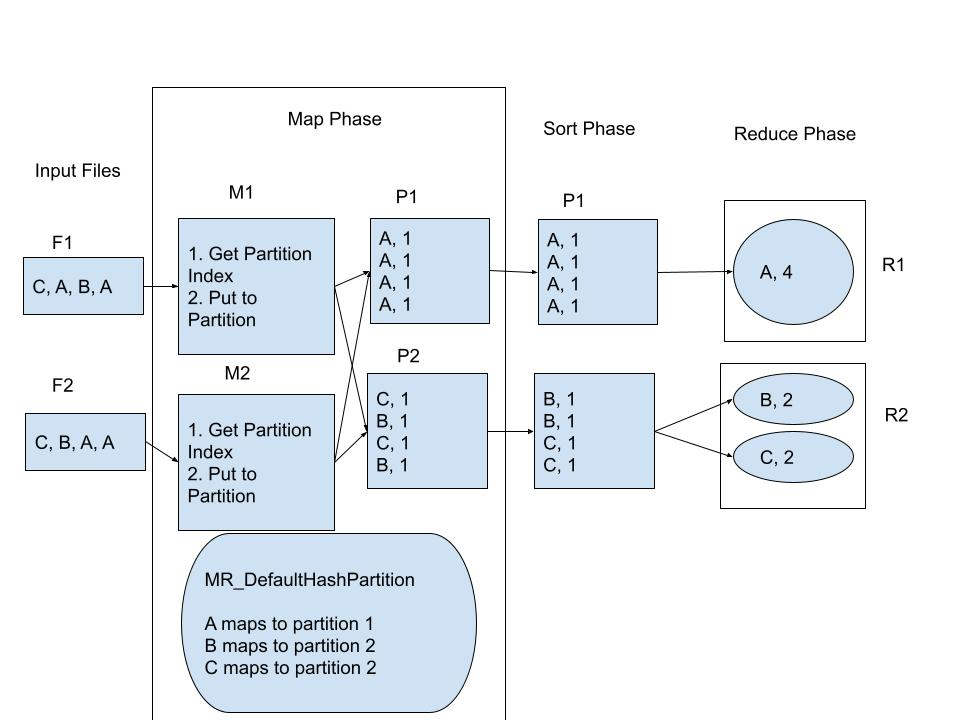

# COMP SCI 537 Discussion Week 8

The plan for this week:
- Map Reduce - How to begin?
- How to do partitioning?
- How to start clone and join?


## Map Reduce - How to begin?

MapReduce is a programming model and an associated implementation for processing and generating big data sets with a parallel, distributed algorithm on a cluster.

In simple words, since one machine cannot fit all data in memory, we’d like multiple machines to split work among themselves and operate on portions of data at a time so as to generate required output.  We’d go over all phases listed below one by one to discuss what each phase does:


### Map Phase:

1. Each Mapper thread(M1 and M2 in figure) reads from 1 file. Say there are two threads and two files, then each thread will concurrently read data from 1 file assigned to it during the thread's creation. Let's say there are two mapper threads and 2 input files, mapper thread M1 will get input file F1 and M2 will get F2. You can think of passing function arguments to the mapper thread about the file it is supposed to read from.

2. Each mapper thread(M1 and M2 in figure) produces intermediate output to all partitions. Mapper thread will ask the partitioner function - say MR_DefaultHashPartition, to find the partition index of an input key. If you’d see the definition of MR_DefaultHashPartition, it returns an index corresponding to a key. That index will
   determine the partition index for a particular input key. Now, one might wonder why partitioning is required. Data partitioning is done to divide and bring all relevant portions of data in one partition.

3. Now, since two mapper threads can write to the same partition, you may want to use pthread_mutex_t for each partition so that only one thread can write to one partition at a time. If you see any garbage values in a partition, this means locking is not working properly. Note that since lock is per-partition, M1 should be able to write to partition P1 and M2 should be able to write to partition P3 concurrently. Thus, different mappers should be able to concurrently access different partitions at a time.


### Sort Phase
1. In this phase we simply need to sort one partition at a time. You just need to run a for-loop which sorts all contents of one partition at a time. Say, you’ll pick partition - P2 and sort all entries of that partition.

2. In the end, you’ll have internally sorted partitions to be consumed by reducer threads.

### Reduce Phase
1. Note that the number of partitions are equal to the number of reducer threads. 

2. Each reducer thread will first pick a key and read intermediate output entries of a key. It will run it’s reduction function on a key. Since Reducer function is supplied as argument to your library, we - as library developers have no control over how final output is consumed.

### Example

Now, let’s have a look at a concrete example - word count and see how this abstraction works with this example.

Map phase : File F1 has C, A, B, A and F2 has C, B, A, A. M1 thread reads all entries from F1, gets the index of each key(A, B or C) from MR_DefaultHashPartition and pushes intermediate outputs to partition 1 or 2. Note that all entries of A are in partition P1, all entries of B are in partition P2 and all entries of C are in partition P3

Sort phase : Simply sort all entries inside a partition. Note that all B’s are before C’s in pairtion P2.

Reduce phase : Reducer thread will pick one key at a time and run the user-provided reduction function on it. Note that reducer thread R2 will first pick key B, run reduction function on it and then pick key C and run reduction function on it. That’s why we have two ovals in R2 indicating that it picks one key at a time.




## Partitioning

Now, let's talk about partitions. What is a partition? Why is it needed? Here we motivate why partitions are needed.
Let’s assume there are no partitions and all mappers write to a single list only, then the mappers’ execution becomes sequential because they’ll have to compete for taking lock on that single list. Mapper threads will waste time waiting for that lock.

So, to avoid the sequentialization, we should have multiple lists. Each list can be seen as a partition which is accessed by all the mappers and reducers.

However, we’re not simply partitioning data, we’re doing that in an intelligent way. MR_Emit() will decide in which partition the data should be stored. For example, the same key(word in example above) will always be stored in the same partition. That way, reducers work is lessened because reducer needs to find all key-value pairs for a particular key and it no longer needs to go through all partitions for finding the same.  Our intelligent partitioning ensures all key-value pairs of a particular key go to the same partition. Also, there’s no need to perform global sort across all partitions. Note that global sort would be much more costly than several local per-partition sort. Our partitioning enables a reducer thread to access only one partition for reduction on a key.


## Locks? Maybe R/W?


### Read Lock API:
The pthread_rwlock_rdlock() function shall apply a read lock to the read-write lock referenced by rwlock. The calling thread acquires the read lock if a writer does not hold the lock and there are no writers blocked on the lock.
```c
int pthread_rwlock_rdlock(pthread_rwlock_t *rwlock);
```
### Write Lock API:

The pthread_rwlock_wrlock() function shall apply a write lock to the read-write lock referenced by rwlock. The calling thread acquires the write lock if no other thread (reader or writer) holds the read-write lock rwlock. Otherwise, the thread shall block until it can acquire the lock. The calling thread may deadlock if at the time the call is made it holds the read-write lock (whether a read or write lock).

```c
int pthread_rwlock_wrlock(pthread_rwlock_t *rwlock);
```
### Common Un-Lock API:
The pthread_rwlock_unlock() function shall release a lock held on the read-write lock object referenced by rwlock. Results are undefined if the read-write lock rwlock is not held by the calling thread.
```c
int pthread_rwlock_unlock(pthread_rwlock_t *rwlock);
```


## How to start with clone() and join()

`clone()` start guide:
```
int
fork(void)
{
  int i, pid;
  struct proc *np;
  struct proc *curproc = myproc();

  // Allocate process.
  if((np = allocproc()) == 0){
    return -1;
  }

  // Copy process state from proc.
  if((np->pgdir = copyuvm(curproc->pgdir, curproc->sz)) == 0){
    kfree(np->kstack);
    np->kstack = 0;
    np->state = UNUSED;
    return -1;
  }
  np->sz = curproc->sz;
  np->parent = curproc;
  *np->tf = *curproc->tf;

  // Clear %eax so that fork returns 0 in the child.
  np->tf->eax = 0;

  for(i = 0; i < NOFILE; i++)
    if(curproc->ofile[i])
      np->ofile[i] = filedup(curproc->ofile[i]);
  np->cwd = idup(curproc->cwd);

  safestrcpy(np->name, curproc->name, sizeof(curproc->name));

  pid = np->pid;

  acquire(&ptable.lock);

  np->state = RUNNABLE;

  release(&ptable.lock);

  return pid;
}
```
Take special care not to copy everything!

Where will args1, args2, fcn, will go?
Hint: stack? 


`join()` start guide:

```
int
wait(void)
{
  struct proc *p;
  int havekids, pid;
  struct proc *curproc = myproc();
  
  acquire(&ptable.lock);
  for(;;){
    // Scan through table looking for exited children.
    havekids = 0;
    for(p = ptable.proc; p < &ptable.proc[NPROC]; p++){
      if(p->parent != curproc)
        continue;
      havekids = 1;
      if(p->state == ZOMBIE){
        // Found one.
        pid = p->pid;
        kfree(p->kstack);
        p->kstack = 0;
        freevm(p->pgdir);
        p->pid = 0;
        p->parent = 0;
        p->name[0] = 0;
        p->killed = 0;
        p->state = UNUSED;
        release(&ptable.lock);
        return pid;
      }
    }

    // No point waiting if we don't have any children.
    if(!havekids || curproc->killed){
      release(&ptable.lock);
      return -1;
    }

    // Wait for children to exit.  (See wakeup1 call in proc_exit.)
    sleep(curproc, &ptable.lock);  //DOC: wait-sleep
  }
}
```

We can have multiple threads. You need to pay special attention not to free memory of the parent process.


References:
1. https://linux.die.net/man/3/pthread_rwlock_wrlock
2. https://linux.die.net/man/3/pthread_rwlock_unlock
3. https://linux.die.net/man/3/pthread_rwlock_rdlock
