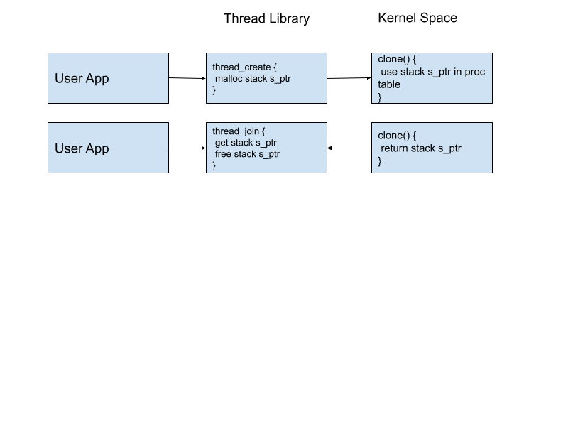
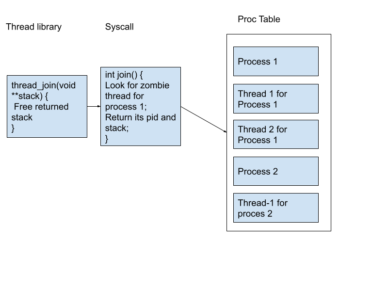

# P3B: xv6 kernel threads project
 
This document lists all hints for xv6 projects and an overall solution strategy. 
Overall Idea:
- Think about what aspects of xv6’s process code can be reused - scheduling, heap memory management etc.
- Think about what aspects of xv6’s process code CANNOT be reused - stack.
- See threads in action by using a pthread starter code or Project 3A. This should give you some understanding of how threads are supposed to behave. 
- All in all, you’re creating a thread library which has two functions
    - thread_create will call clone syscall to create a thread.
    - thread_join will call join syscall to wait for any completed thread that was created using thread_create.


## Overall Solution strategy:
- Implement clone() system call and corresponding thread_create API to test if thread creation is working. 
- Next, implement the join() system call and thread_join API
- Once both thread_create and thread_join are working, test both of the APIs
- For testing, you can create a small user application, and implement counter increments of a global variable. 
- Now implement ticketlock in the same thread library to protect this counter variable from race conditions. 
- Use the same user application to test ticketlock implementation. 
- Run public tests and solve bugs

## Hints:
- Clone and join hints are part of project specifications and week-7/week-8 discussion material. 
- Thread_create and thread_join are userspace(defs.h vs user.h) libraries. We need to implement syscalls before we use these libraries. Syscalls will be used from within these libraries.
- User stack vs kernel stack: 
    - Each thread will have its own user allocated stack, which is different from the parent process’s stack 
    - Originally, a process uses the default stack allocated via allocproc. We need to change the logic such that the OS now use stack allocated in thread_create(). There are a few examples such as fork(), userinit() and exec(). Check these functions and make your clone use the user allocated stack. 
    -  Read process creation from xv6 book(page 23)
- Thread API library will be similar to ulib.c  (Big Hint!)
- Do not use attribute for ticket lock.

Examples of different stack and trapframe use:

- `userinit()`
```C
void
userinit(void)
{
  struct proc *p;
  extern char _binary_initcode_start[], _binary_initcode_size[];

  p = allocproc();
  
  initproc = p;
  if((p->pgdir = setupkvm()) == 0)
    panic("userinit: out of memory?");
  inituvm(p->pgdir, _binary_initcode_start, (int)_binary_initcode_size);
  p->sz = PGSIZE;
  memset(p->tf, 0, sizeof(*p->tf));
  p->tf->cs = (SEG_UCODE << 3) | DPL_USER;
  p->tf->ds = (SEG_UDATA << 3) | DPL_USER;
  p->tf->es = p->tf->ds;
  p->tf->ss = p->tf->ds;
  p->tf->eflags = FL_IF;
  p->tf->esp = PGSIZE;
  p->tf->eip = 0;  // beginning of initcode.S

  safestrcpy(p->name, "initcode", sizeof(p->name));
  p->cwd = namei("/");

  // this assignment to p->state lets other cores
  // run this process. the acquire forces the above
  // writes to be visible, and the lock is also needed
  // because the assignment might not be atomic.
  acquire(&ptable.lock);

  p->state = RUNNABLE;

  release(&ptable.lock);
}
```
- `exec()`
```C
int
exec(char *path, char **argv)
{
  char *s, *last;
  int i, off;
  uint argc, sz, sp, ustack[3+MAXARG+1];
  struct elfhdr elf;
  struct inode *ip;
  struct proghdr ph;
  pde_t *pgdir, *oldpgdir;
  struct proc *curproc = myproc();
  // .
  // .
  // . irrelevant part

  ustack[3+argc] = 0;

  ustack[0] = 0xffffffff;  // fake return PC
  ustack[1] = argc;
  ustack[2] = sp - (argc+1)*4;  // argv pointer

  sp -= (3+argc+1) * 4;
  if(copyout(pgdir, sp, ustack, (3+argc+1)*4) < 0)
    goto bad;

  // Save program name for debugging.
  for(last=s=path; *s; s++)
    if(*s == '/')
      last = s+1;
  safestrcpy(curproc->name, last, sizeof(curproc->name));

  // Commit to the user image.
  oldpgdir = curproc->pgdir;
  curproc->pgdir = pgdir;
  curproc->sz = sz;
  curproc->tf->eip = elf.entry;  // main
  curproc->tf->esp = sp;
  // .
  // .
  // . rest of the code
```


## Demo 
Stackoverflow [link](https://stackoverflow.com/questions/10534798/debugging-user-code-on-xv6-with-gdb) to GDB for user application.

## Thread properties:
A thread is just like a process:
- Thread is independently schedulable. Thus, we can use the existing proc table of xv6  to schedule threads as well BUT we need to keep a mapping between threads and their parent process. This mapping is required because if the process is killed, then its child threads need to be killed as well. On the other hand, if a thread has completed its job, the parent process may want to know about it – using join. 
- Thread only has its own stack. In this project, we want to supply a user-space stack(allocated via malloc) to thread, thus, this stack needs to be kept in proc structure.
- Thread shares process’s page table, memory size and trap frame, file descriptors etc. Thus, all these things are assigned in clone.


## How to do a function call?
Since we want clone to begin execution of user-provided function, thus Clone syscall should put some values in user-provided stack and thread’s trapframe will have its values assigned to this stack. Think about what exactly needs to be copied. Overall, Stack should have :  
- Return’s address - This is the point where execution should return once thread is executed in its entirety. Since we don’t want thread to execute anything once its function is done, we’ll put 0xFFFFFFFF in stack. This address is basically a  dangling memory address.
- Argument 1 passed to clone.
- Argument 2 passed to clone.


## Important things to know before coding

- Clearly, proc structure needs to be modified. Now, one should think about what to keep in stack. You may want to keep thread_count, user-malloced stack pointer in proc structure. If you’re thinking what is user-malloced stack pointer, it is the one being provided to clone syscall.
- Why does join syscall has double pointer to stack as argument but clone syscall only has a pointer to stack as argument? This is because we’d like join syscall to fill stack pointer for us. thread_create will create stack and supply stack to clone syscall.

- How to page-align stack in thread_create(piazza)? One way is to allocate 2 * page size memory, see how far base of stack is from page boundary(by modulating with page size) and move your pointer by that amount.


